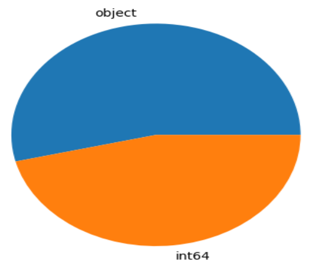
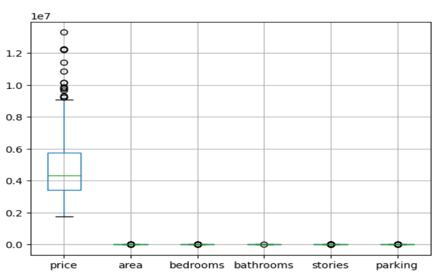
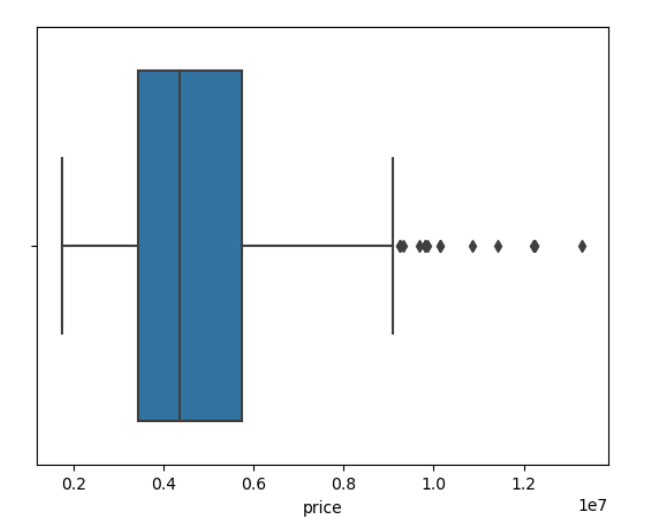
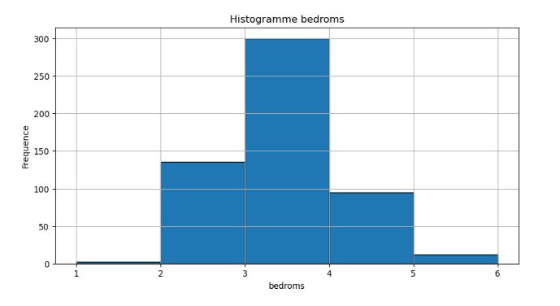
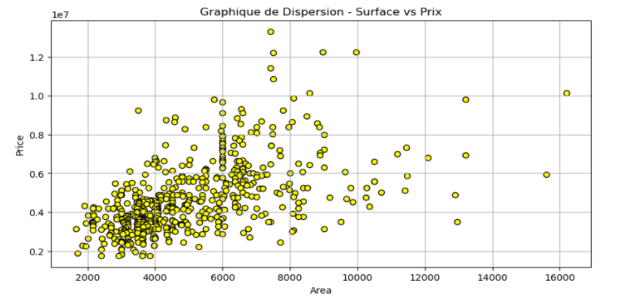
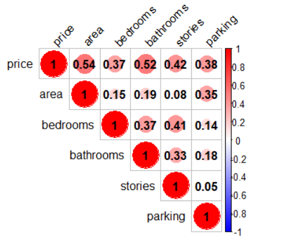

## RAPPORT DU PROJET FINAL PYTHON/R

### Membres du groupe
1- ADISSO Nelxie IA 9%
2- AGBOHOUN Obed GL 9%
3- ANAGO Miguel IA 9% 
4- AZON Joanes GL 9%
5- FAIZOUN Cendrelle GL 9%
6- FAVI Ebenezer GL 9%
7- LAOUROU Jennifer GL 9%
8- MIKO Sènakpon Jean-Baptiste GL 9%
9- SEKPE Gbetondji Dimitri Alberic IA 9% 
10- YEHOUETA Edme Jorias Mahugnon IA 9%

### TACHE 1
Cette tâche consiste en l'implémentation d'une classe Array en Python pour répliquer certaines fonctionnalités de base de la bibliothèque NumPy. La classe permet la création de tableaux à une ou deux dimensions et supporte diverses opérations élémentaires telles que l'addition, la soustraction, la multiplication, et la division. Le produit scalaire et la recherche d'éléments sont également implémentés. Les opérations élémentaires sont définies en surchargeant les opérateurs correspondants pour les tableaux 1D et 2D. L'indexage et le slicing sont gérés par la surcharge des méthodes `__getitem__` et `__setitem__`. Des tests unitaires ont été effectués pour valider chaque fonctionnalité implémentée. Cette classe Array permet ainsi la manipulation et l'opération sur les tableaux 1D et 2D, reproduisant plusieurs fonctionnalités de base de NumPy et pouvant servir de base pour des développements futurs.

## TACHE 2 : Tracé de Graphiques et Analyse de Données

Faire une analyse de données avancée en Python ou R implique plusieurs étapes, allant de la compréhension des données brutes à la communication ou interprétation des résultats issue des différents graphes affichés. Voici les principales étapes détaillées :

### 1. COMPREHENSION ET PREPARATION DES DONNEES (Prétraitement)

#### Collecte des données
Elle consiste généralement d’aller à la rencontre de nos données à traiter tout en créant un sondage pour pouvoir récupérer ses données dans une base de données ensuite l’importer dans un environnement de travail pour son analyse. Alors nous allons utiliser un fichier ‘Housing.csv’ télécharger sur Kaggle sur lequel on est amené à faire une analyse en python et en R. Pour importation de cette base de donnée (dataset), on utilise souvent la bibliothèque pandas en python et en R lire notre base à l’aide de ‘read.csv’ pour les fichiers de type CSV.

#### Exploration initiale des données dans ‘Housing.csv’
Cette sous-étape a pour but de comprendre la structure des données encore appelé Métadonnées.
- La taille du dataset est 543 lignes et 13 colonnes.
- Information sur les colonnes : 'price', 'area', 'bedrooms', 'bathrooms', 'stories', 'parking', ‘mainroad’, ‘guestroom’, ‘basement’, ‘Hotwaterheating’, ‘airconditioning’, ‘prefarea’, ‘Furnishingstatus’.

- Un résumé statistique sur le dataset ‘Housing.csv’.

#### Nettoyage des données
- Il n’y a pas du tout de valeurs manquantes dans le dataset après vérification et visualisation.
- Mais quant aux valeurs aberrantes, seule la colonne ‘price’ contient 15 valeurs aberrantes avec un pourcentage de 2.75%.

### 2. ANALYSE EXPLORATOIRE DES DONNEES (EDA)

Pour faire les visualisations dans une analyse de données on utilise généralement la bibliothèque matplotlib.pyplot en python et ggplot en R.

#### Visualisation de la colonne ‘bedrooms’

**CONCLUSION :** d’après la distribution de la colonne ‘bedrooms’, on peut dire qu'elle est symétrique.

#### Graphiques de dispersion de la colonne ‘area’ et ‘price’

**CONCLUSION :** ce graphe permet une compréhension approfondie de la relation entre la surface et le prix des propriétés dans le jeu de données, ainsi que la détection des valeurs aberrantes.

#### Matrix de corrélation du dataset avec ‘ggplot’

**CONCLUSION :** la matrice de corrélation est vraiment importante pour pouvoir faire du feature selection, elle permet de voir la relation ou le lien entre les variables deux à deux de notre dataset en général. On peut en déduire ici qu’il n’y a pas une forte corrélation entre les colonnes de notre jeu de données.

### TACHE 3 
L’objectif est de créer une application GUI qui permettra de générer des images avec le modèle léger de Hugging Face, tiny-stable-diffusion-pipe, avec Tkinter en Python. Avec notre application générez vos images en toute sécurité.

Pour utiliser l'application de génération d'images, suivez ces étapes simples : après le lancement de l'application, saisissez une description dans le champ prévu, puis cliquez sur le bouton "Générer". Pendant le traitement, une animation GIF de chargement indiquera l'avancement. Une fois l'image générée, elle s'affichera dans le cadre dédié. Vous pouvez enregistrer l'image en cliquant sur le bouton "Retour" pour quitter l'application ou générer d'autres images en répétant le processus. Cette interface intuitive facilite la création d'images à partir de descriptions textuelles, offrant ainsi une expérience conviviale et interactive.
